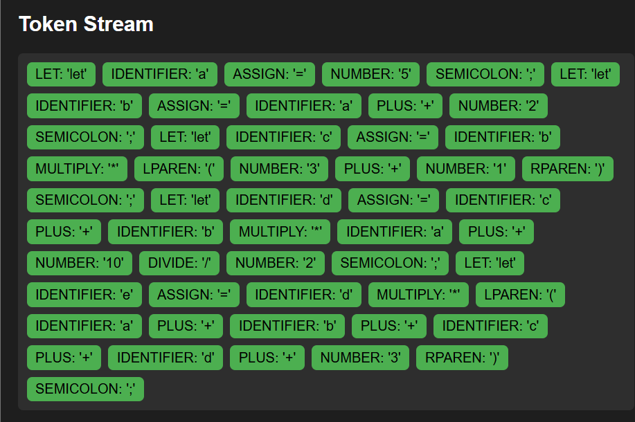
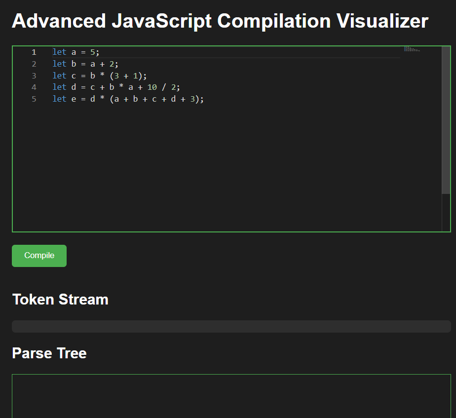
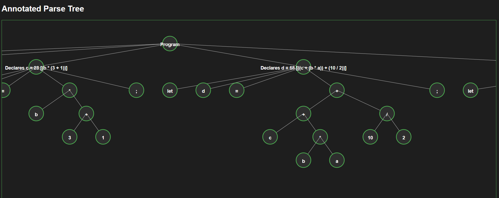
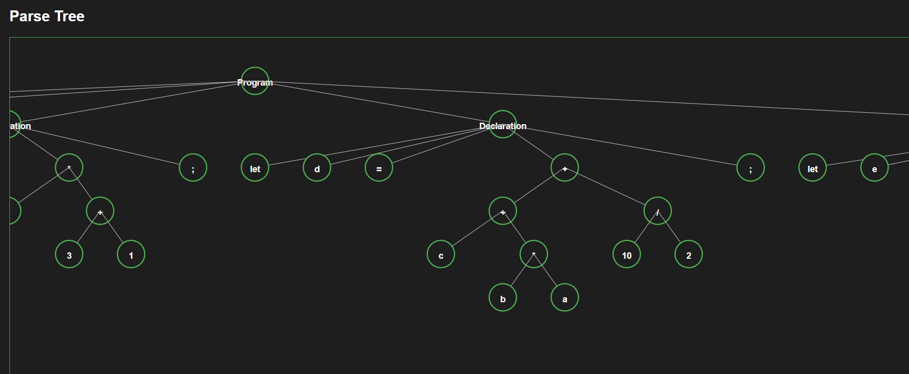

# 🌐 Three Phases of Compiler Visualization  

A web-based tool to **visualize the first three phases of a compiler** – **Lexical Analysis, Syntax Analysis, and Semantic Analysis** – using **HTML, CSS, JavaScript, and a visualization library**.  

This project takes source code as input and generates an **Annotated Parse Tree**, allowing students and developers to understand how compilers process code step by step.  

---

## 🚀 Features  
- 🔹 **Lexical Analysis** → Breaks input into tokens.  
- 🔹 **Syntax Analysis** → Builds a parse tree structure.  
- 🔹 **Semantic Analysis** → Adds annotations to the parse tree.  
- 🔹 **Visualization** → Interactive tree visualization using JavaScript libraries.  
- 🔹 **Frontend Only** → Runs in browser with no backend required.  

---

## 🛠️ Tech Stack  
- **Frontend:** HTML, CSS, JavaScript  
- **Visualization Library:** D3.js (or Vis.js / Chart.js)  
- **Output:** Interactive Annotated Parse Tree  

---

## 📸 Screenshots  
 
 
  
  


---

## 🔧 Installation & Usage  

1. **Clone the repository**  
```bash
git clone https://github.com/<username>/<repo-name>.git
cd <repo-name>
